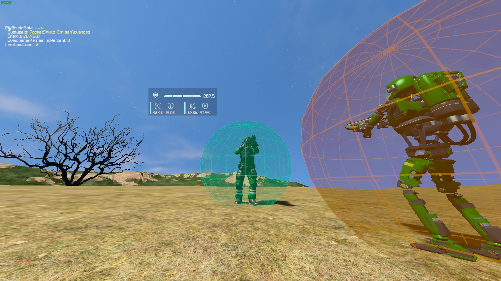

This is the official repository for Pocket Shield Core mod for Keen Software House's "Space Engineers" game.\
This mod will be a part of my "Back to the reality" modpack? challenge?, in which the Engineer stays on Earthlike planet most of their time.

# Pocket Shield Core

This mod is a framework for adding personal shield generator, the Pocket Shield.\
Any characters (Enginners, Wolves, Spiders, AI Enabled Bots, ...) can benefit from this shield if they have the Shield Emitter item in their inventory.

This mod doean't actually add any item in game. It acts as a framework to handle logic for personal shield. You will have to provide it with needed data to create your own items.\
Example mod can be found [here (Pocket Shield)](https://github.com/3x3y3z3t/Pocket-Shield/tree/v3).

Here is [Pocket Shield Core on Steam](https://steamcommunity.com/sharedfiles/filedetails/?id=2739353433).

# Notes
- **This mod may break your server**. I don't play MP so I can not test for bugs on MP/DS. Many thanks if you sacrifice your server and report me MP/DS bugs (I may not be able to fix them though).

# Version
Current version: v1.6.5
